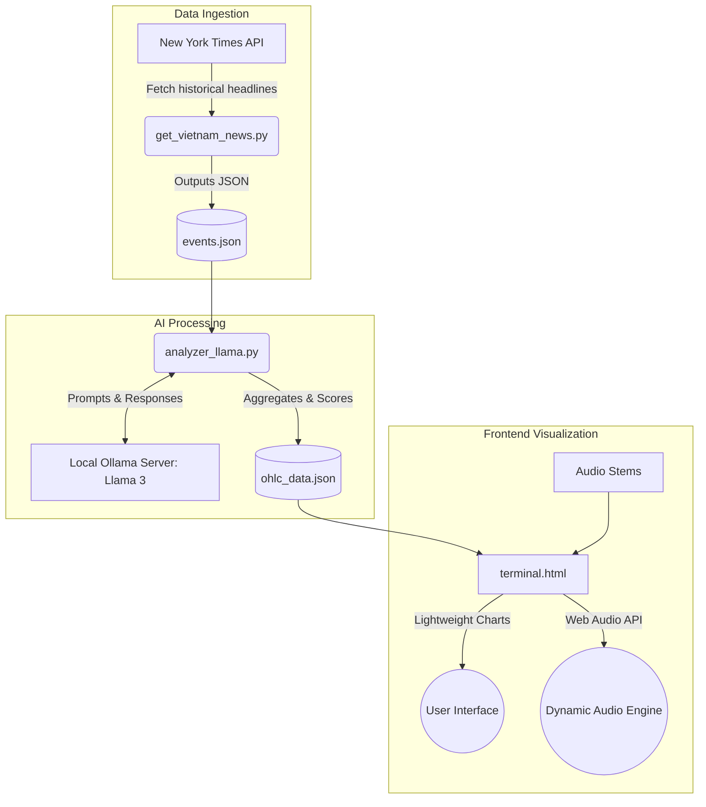

# Vietnam War Sentiment Terminal: A Time Machine Experience

## Project Description and Artistic Expression

The **Vietnam War Sentiment Terminal** is a retro-themed, interactive data visualization project that acts as a "Time Machine." It maps historical sentiment trends regarding the Vietnam War across 30 years of New York Times headlines (1950–1980). The core artistic vision is to blend cold, hard historical data with a cinematic, atmosphere-aware experience. By transforming textual news data into an interactive financial-style candlestick chart and pairing it with a dynamic, momentum-based audio crossfade system, the project allows users to emotionally and visually explore the shifting tides between Pro-Peace and Pro-War sentiments during one of the most turbulent periods in modern history.

## Technical Architecture Overview

The system is built on a decoupled architecture, consisting of a data ingestion pipeline, an AI-powered sentiment analysis engine, and an interactive frontend dashboard.



### Components:
1. **Data Ingestion (`fetch_ news/get_vietnam_news.py`)**: Fetches 30 years of news headlines using the NYT Archive API.
2. **AI Processing (`analyze_data/analyzer_llama.py`)**: Uses a local Llama-3 model to analyze the sentiment of each headline and generate candlestick (OHLC) data based on cumulative sentiment shifts.
3. **Frontend Dashboard (`terminal.html`)**: A retro CRT-styled UI built with Lightweight Charts for visualizing data, featuring a dynamic Web Audio API engine that crossfades stems based on the active sentiment score.

## Setup and Execution Instructions

To ensure a seamless evaluation, please follow these instructions to run the project locally.

### Prerequisites
- Python 3.8+
- Node.js (Optional, for Live Server)
- [Ollama](https://ollama.com/) installed and running locally.

### Step 1: Install Dependencies
Install the required Python packages:
```bash
pip install requests tqdm
```

### Step 2: Configure API Keys and AI
1. **New York Times API Key**:
   - Open `fetch_ news/get_vietnam_news.py`.
   - Locate line 7: `API_KEY = "YOUR_API_KEY"`.
   - Ensure your NYT API Key is placed here. (The current key in the script should be replaced if it expires).
2. **Ollama Setup**:
   - Start the Ollama application on your computer.
   - Open a terminal and pull the Llama 3 model by running:
     ```bash
     ollama run llama3
     ```
   - Keep the Ollama server running in the background.

### Step 3: Run the Pipeline (Optional if JSON files exist)
If `ohlc_data.json` is already present, you can skip to Step 4. Otherwise, generate the data:
1. Fetch news: `python fetch_\ news/get_vietnam_news.py`
2. Analyze data: `python analyze_data/analyzer_llama.py`

### Step 4: Launch the Terminal
Since the frontend uses ES6 modules and fetch API, it must be served via a local web server (opening the HTML file directly in the browser will cause CORS errors). 

To make this seamless, a standalone executable has been provided:
- **Quick Launch**: Simply double-click the `Vietnam_Terminal_Launcher.exe` file located in the root project folder. This will automatically start a local background server on an available port and immediately open the terminal interface in your default web browser.

*(Alternatively, you can manually run `python -m http.server 8000` and visit `http://localhost:8000/terminal.html`)*

## Generative AI Techniques and Interactions

This project utilizes two primary generative AI techniques that work in tandem:

1. **Large Language Model (Llama-3 via Ollama) for Sentiment Generation**: 
   - *Technique*: NLP-based Contextual Analysis & Classification.
   - *Interaction*: The Python backend feeds historical headlines to the local Llama-3 model. The AI evaluates the contextual nuance of cold-war era language to output a JSON object containing a severity score (-100 to +100) and a label (PRO-WAR, PRO-PEACE, NEUTRAL). This generated sentiment data directly drives the visual amplitude (candlestick size) and the audio engine.
   
2. **Generative AI Assistant for Code & Architecture**:
   - *Technique*: AI-Assisted Pair Programming (Gemini / Claude).
   - *Interaction*: LLMs were extensively used during the development process to architect the complex dynamic Web Audio API engine (crossfading 4 independent audio stems based on real-time data metrics), structure the project, and translate the entire codebase and UI from Turkish to English.

## Dependencies and API Requirements

- **Python Requirements**:
  - `requests` (for NYT API and Ollama local server communication)
  - `tqdm` (for processing progress bars)
  - `json`, `time`, `sys`, `random` (Standard Library)
- **External APIs**:
  - **New York Times Archive API**: Requires an active developer key to fetch historical article metadata.
- **Local Services**:
  - **Ollama API**: Hosted locally at `http://localhost:11434/api/generate` to process prompts privately and without rate limits.
- **Frontend Libraries**:
  - **Lightweight Charts** (`unpkg.com/lightweight-charts@4.1.1`): Used for rendering the high-performance financial-style UI.

## Sample Outputs or Screenshots

- **Terminal Interface:**
  
  *The main interface showing the CRT scanline effect, candlestick charting of sentiment, and the intercepted transmissions log.*

---

## Academic Integrity Requirements

### Transparency
- **AI Models Used**: 
  - Meta's `Llama-3` (8B parameter model) was run locally via Ollama to perform all textual data analysis and sentiment scoring.
  - LLM coding assistants (Google Gemini / Anthropic Claude) were utilized as pair programmers to assist with JavaScript audio engine logic, refactoring the directory structure, and performing localization translations.
- **Data Sourcing**: All historical data was fetched directly from the public New York Times Archive API.

### Attributions
- **Frontend Visualization Library**: The charting system is powered by [TradingView Lightweight Charts](https://github.com/tradingview/lightweight-charts).
- **Backend Infrastructure**: Local LLM inference made possible by [Ollama](https://github.com/ollama/ollama).
- **Audio Assets**: The stems used in the `stems/` directory are independent audio tracks utilized specifically to demonstrate the dynamic audio crossfade capabilities of the Web Audio API. 
- **Code Snippets**: The foundational Web Audio API boilerplate for the delay/reverb and gain nodes was adapted from standard MDN Web Docs examples.
